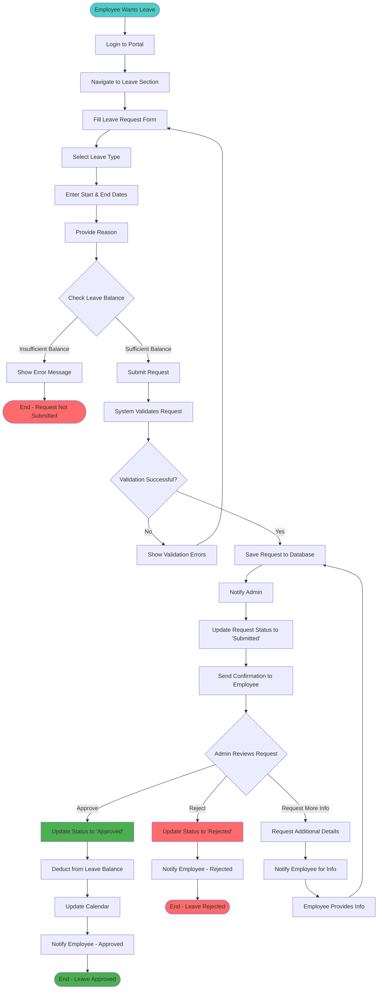
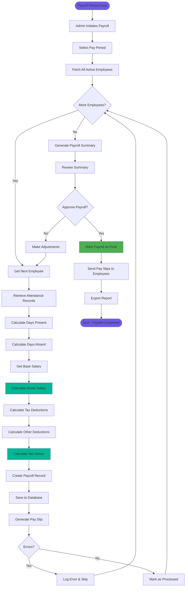
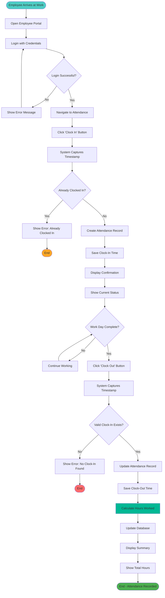
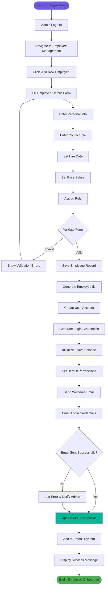

# Activity Diagram

## Overview
Activity diagrams show the workflow processes in the Smart Attendance & Employee Management System. This document includes activity diagrams for key processes.

## 1. Leave Request Process

## 2. Payroll Calculation Process

## 3. Employee Attendance Tracking

## 4. Employee Onboarding Process

## Process Descriptions

### Leave Request Process
This workflow shows how employees request leave and how administrators process those requests. Key decision points include leave balance validation and admin approval.

**Key Steps:**
1. Employee submits leave request with details
2. System validates request and checks balance
3. Admin reviews and approves/rejects
4. System updates leave balance and notifies employee

### Payroll Calculation Process
This workflow illustrates the automated payroll calculation for all employees based on attendance records.

**Key Steps:**
1. Admin initiates payroll for pay period
2. System processes each employee individually
3. Calculates gross salary, deductions, and net salary
4. Generates pay slips and reports
5. Admin reviews and approves final payroll

### Attendance Tracking Process
This workflow shows the daily clock-in and clock-out process for employees.

**Key Steps:**
1. Employee logs in to portal
2. Clicks clock-in at start of day
3. System records timestamp
4. Employee clicks clock-out at end of day
5. System calculates total hours worked

### Employee Onboarding Process
This workflow shows how administrators add new employees to the system.

**Key Steps:**
1. Admin enters employee details
2. System creates employee record and user account
3. Generates login credentials
4. Initializes leave balance
5. Sends welcome email to employee

## Decision Points

- **Leave Balance Check**: Ensures employee has sufficient leave days
- **Validation Checks**: Ensures data integrity throughout processes
- **Admin Approval**: Manual review point for leave requests
- **Error Handling**: Proper error handling at critical points

## Parallel Activities

Some processes can occur in parallel:
- Sending notifications while updating database
- Generating reports while processing next employee
- Creating user account while initializing leave balance
