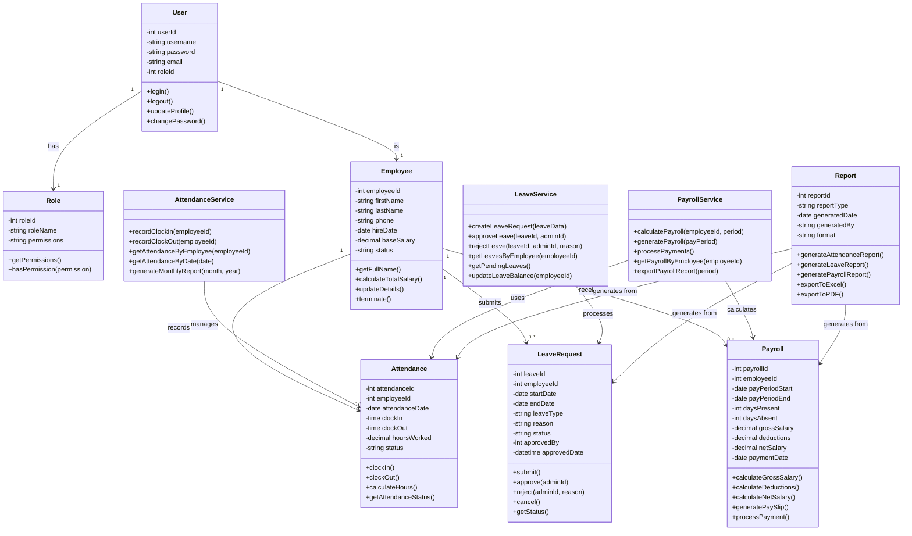

# Class Diagram

## Overview
This diagram shows the object-oriented structure of the Smart Attendance & Employee Management System, including classes, their attributes, methods, and relationships.

## Class Structure

## Class Descriptions

### Core Entity Classes

#### User
Represents system users (both Admin and Employee)
- **Attributes**: User credentials and profile information
- **Methods**: Authentication and profile management
- **Relationships**: Has one Role, is one Employee

#### Role
Defines user roles and permissions
- **Attributes**: Role name and permission strings
- **Methods**: Permission checking and retrieval
- **Relationships**: Can be assigned to multiple Users

#### Employee
Stores employee information and employment details
- **Attributes**: Personal info, hire date, salary, status
- **Methods**: Profile management, salary calculations
- **Relationships**: Records Attendance, submits LeaveRequests, receives Payroll

#### Attendance
Tracks daily attendance records
- **Attributes**: Clock-in/out times, hours worked, status
- **Methods**: Time tracking and hour calculations
- **Relationships**: Belongs to one Employee

#### LeaveRequest
Manages leave applications
- **Attributes**: Leave dates, type, reason, approval status
- **Methods**: Submit, approve, reject, cancel operations
- **Relationships**: Submitted by one Employee, approved by one Admin

#### Payroll
Handles salary calculations and payments
- **Attributes**: Pay period, attendance summary, salary breakdown
- **Methods**: Salary calculations, pay slip generation
- **Relationships**: Belongs to one Employee

### Service Classes

#### AttendanceService
Business logic for attendance management
- **Methods**: Clock-in/out processing, report generation
- **Relationships**: Manages Attendance entities

#### LeaveService
Business logic for leave management
- **Methods**: Leave request processing, approval workflow
- **Relationships**: Processes LeaveRequest entities

#### PayrollService
Business logic for payroll processing
- **Methods**: Salary calculations, payment processing
- **Relationships**: Calculates Payroll, uses Attendance data

### Utility Classes

#### Report
Generates various system reports
- **Methods**: Report generation and export functionality
- **Relationships**: Aggregates data from Attendance, LeaveRequest, Payroll

## Key Relationships

- **User-Role**: One-to-One (each user has exactly one role)
- **User-Employee**: One-to-One (each user is linked to one employee record)
- **Employee-Attendance**: One-to-Many (employee has multiple attendance records)
- **Employee-LeaveRequest**: One-to-Many (employee can submit multiple leave requests)
- **Employee-Payroll**: One-to-Many (employee receives multiple payroll entries)

## Design Patterns

- **Service Layer Pattern**: Separation of business logic into service classes
- **Entity Pattern**: Core domain objects (Employee, Attendance, etc.)
- **Repository Pattern**: Data access abstraction (implied)
- **Factory Pattern**: Object creation (for complex entities like Payroll)