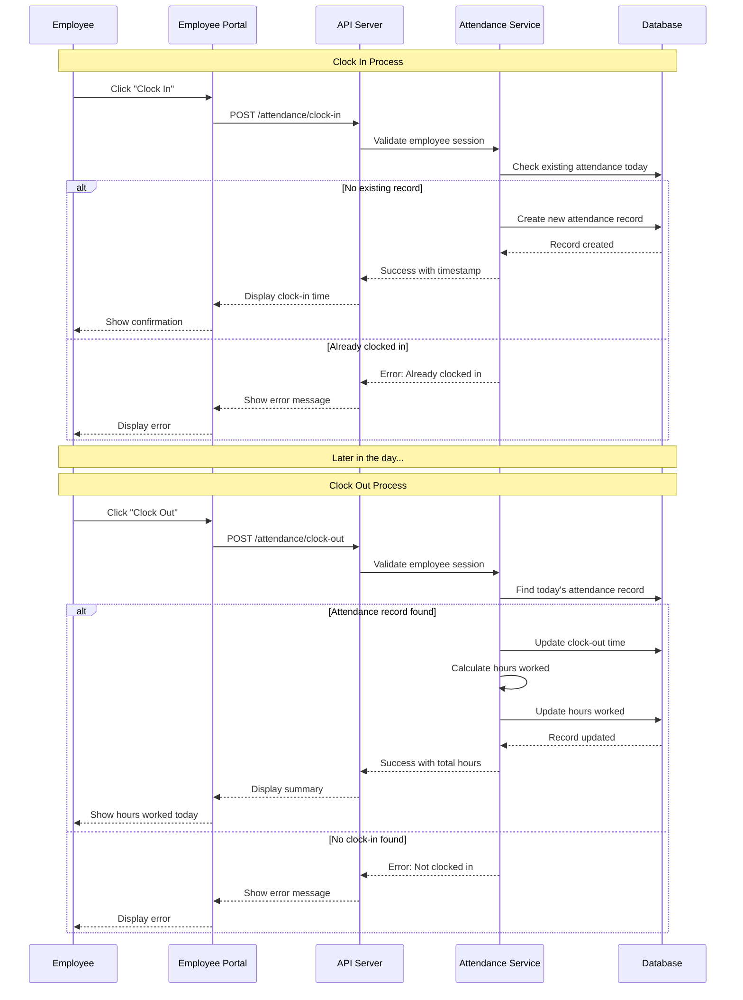

# Sequence Diagram - Clock In/Out Process

## Overview
This sequence diagram shows the detailed interactions between system components during the employee clock-in and clock-out process.

## Clock In/Out Sequence



## Process Steps

### Clock In Process

1. **Employee Action**: Employee clicks "Clock In" button
2. **API Request**: Portal sends POST request to `/attendance/clock-in`
3. **Validation**: API Server validates employee session token
4. **Database Check**: System checks if employee already clocked in today
5. **Record Creation**: If not clocked in, create new attendance record
6. **Confirmation**: Return success with timestamp to employee

### Clock Out Process

1. **Employee Action**: Employee clicks "Clock Out" button
2. **API Request**: Portal sends POST request to `/attendance/clock-out`
3. **Validation**: API Server validates employee session token
4. **Record Lookup**: System finds today's attendance record
5. **Update Record**: Update clock-out time in database
6. **Calculate Hours**: System calculates total hours worked
7. **Confirmation**: Display summary with total hours to employee

## Error Scenarios

### Clock In Errors
- **Already Clocked In**: Employee attempts to clock in twice in same day
- **Invalid Session**: Employee session has expired
- **System Error**: Database or server error

### Clock Out Errors
- **Not Clocked In**: Employee tries to clock out without clocking in first
- **Invalid Session**: Employee session has expired
- **Record Not Found**: Attendance record missing from database

## Data Flow

### Clock In Request
```json
{
  "employee_id": 123,
  "timestamp": "2025-12-13T09:00:00Z",
  "location": "Office HQ"
}
```

### Clock In Response (Success)
```json
{
  "status": "success",
  "attendance_id": 456,
  "clock_in": "09:00:00",
  "message": "Clocked in successfully"
}
```

### Clock Out Request
```json
{
  "employee_id": 123,
  "timestamp": "2025-12-13T17:30:00Z"
}
```

### Clock Out Response (Success)
```json
{
  "status": "success",
  "attendance_id": 456,
  "clock_in": "09:00:00",
  "clock_out": "17:30:00",
  "hours_worked": 8.5,
  "message": "Clocked out successfully"
}
```

## Business Rules

- Employee can clock in only once per day
- Clock out requires a prior clock in
- Hours are calculated as: Clock Out Time - Clock In Time
- System records timestamp for audit purposes
- Attendance status is updated automatically
