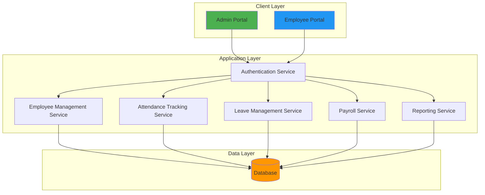

# System Architecture Diagram

## Overview
This diagram illustrates the three-tier architecture of the Smart Attendance & Employee Management System, showing how the client layer, application layer, and data layer interact with each other.

## Architecture Layers

- **Client Layer**: User-facing portals (Admin and Employee)
- **Application Layer**: Core business logic services
- **Data Layer**: Database for persistent storage

## Diagram

## Key Components

### Client Layer
- **Admin Portal**: Interface for administrators to manage the system
- **Employee Portal**: Interface for employees to track attendance and request leave

### Application Layer
- **Authentication Service**: Handles user login and authorization
- **Employee Management Service**: CRUD operations for employee records
- **Attendance Tracking Service**: Manages clock-in/out and attendance records
- **Leave Management Service**: Processes leave requests and approvals
- **Payroll Service**: Calculates salaries based on attendance
- **Reporting Service**: Generates various reports and exports

### Data Layer
- **Database**: Centralized data storage for all system information

## Data Flow
1. Users access the system through their respective portals
2. All requests pass through the Authentication Service
3. Authenticated requests are routed to appropriate services
4. Services interact with the database for data operations
5. Results are returned to the user through the portal