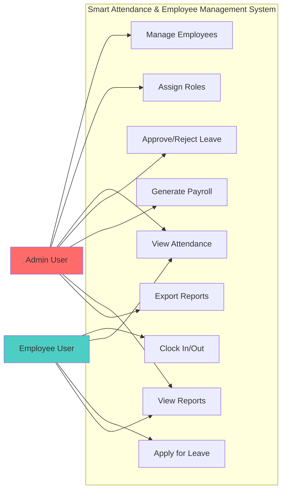

# Use Case Diagram

## Overview
This diagram illustrates the different use cases for both Admin and Employee users, showing what actions each user type can perform in the system.

## Use Cases

## User Roles

### Admin User
Administrators have full access to manage the system:
- **Manage Employees**: Add, edit, and delete employee records
- **Assign Roles**: Set user permissions and roles
- **View Attendance**: Monitor all employee attendance
- **Approve/Reject Leave**: Process leave requests
- **Generate Payroll**: Calculate and process salaries
- **View Reports**: Access all system reports
- **Export Reports**: Download reports in various formats

### Employee User
Employees have limited access to manage their own data:
- **Clock In/Out**: Record daily attendance
- **View Attendance**: Check their own attendance history
- **Apply for Leave**: Submit leave requests
- **View Reports**: Access their personal reports (attendance, leave, payroll)

## Access Control

The system implements role-based access control (RBAC) where:
- Each user is assigned a role upon account creation
- Roles determine which use cases a user can access
- Admin users have elevated privileges
- Employee users can only access their own data